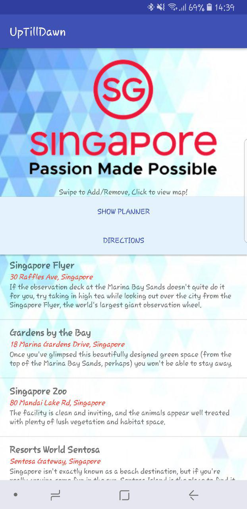
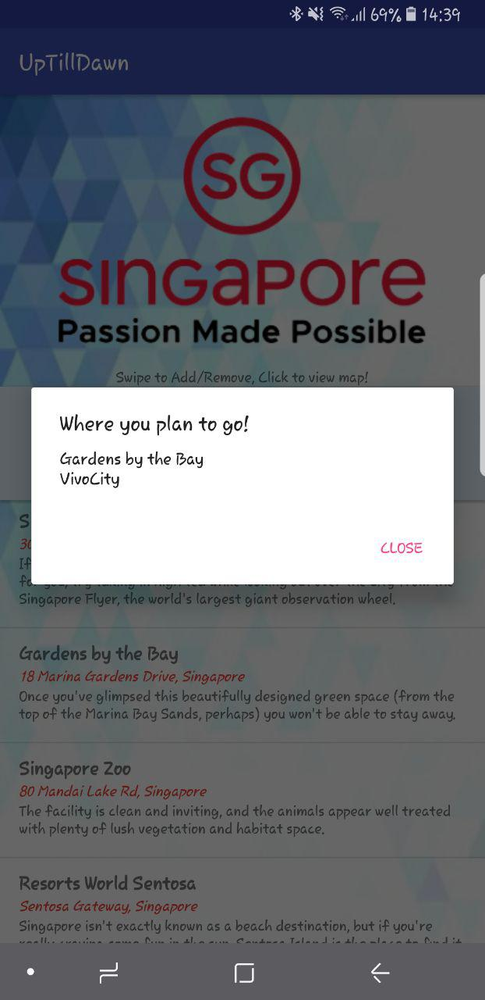
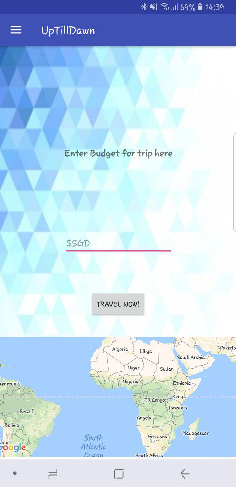
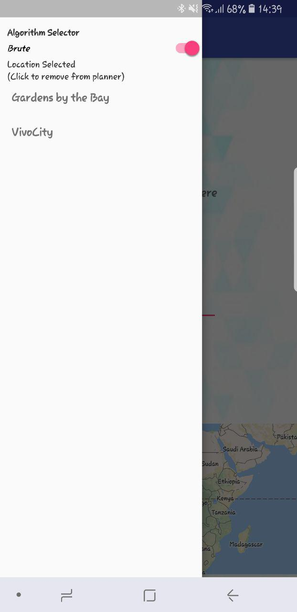
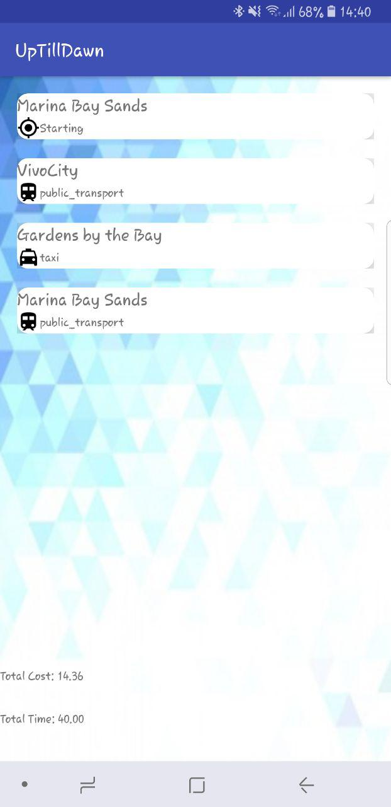

# SUTD Tourism App

**SUTD ISTD Term 4 Android Project:** Tourism App.
The aim of the project was to design an application that provides tourist with basic information on places of interest in Singapore, as well as incorporate a planner for them such that they can add in locations that they want to travel to and the app will calculate the most optimal route base on their budget.

The app contains the ability to add preset locations in the app to a scheduler, whilst providing information on the location.

The scheduler then runs an algorithm to find the most optimal path base on the user's transport budget. 2 algorithms are provided, one faster but less accurate, the other much slower but accurate









## Getting Started

Only the main programming files are added into the repository.

A copy of the app apk file is also available.

### Prerequisites

If you wish to edit the app's code, you will require [android studio](https://developer.android.com/studio/index.html). Next, create a new app and copy the relevant codes into the corresponding section of the app.

If you only wish to play with the app, just download the apk file and install it onto your android phone.

## Usage

On the location page, the following functionality are implemented
```
Swipe from the left to the right to add the location to your planner
Swipe from the right to the left to remove the location from the planner
Click on the location to view the location on google maps
Click and hold on the location to view images from the location 
```

On the planner page, the following functionality are implemented
```
Tapping on the top left opens a drawer for people to view the currently planned locations
Long press on these locations will remove them from the planner
Enter the budget and then clicking go will calculate a route for the user base on the algorithm chosen in the drawer
```

## Built With

* [Java](https://java.com/en/) - Backend coding
* [XML](https://developer.mozilla.org/en-US/docs/XML_introduction) - Views
* [Android](https://developer.android.com/studio/index.html)

## Authors

* **Chang Jun Qing**
* **Soong Cun Yuan**
* **Yang Lei**

## Acknowledgments
